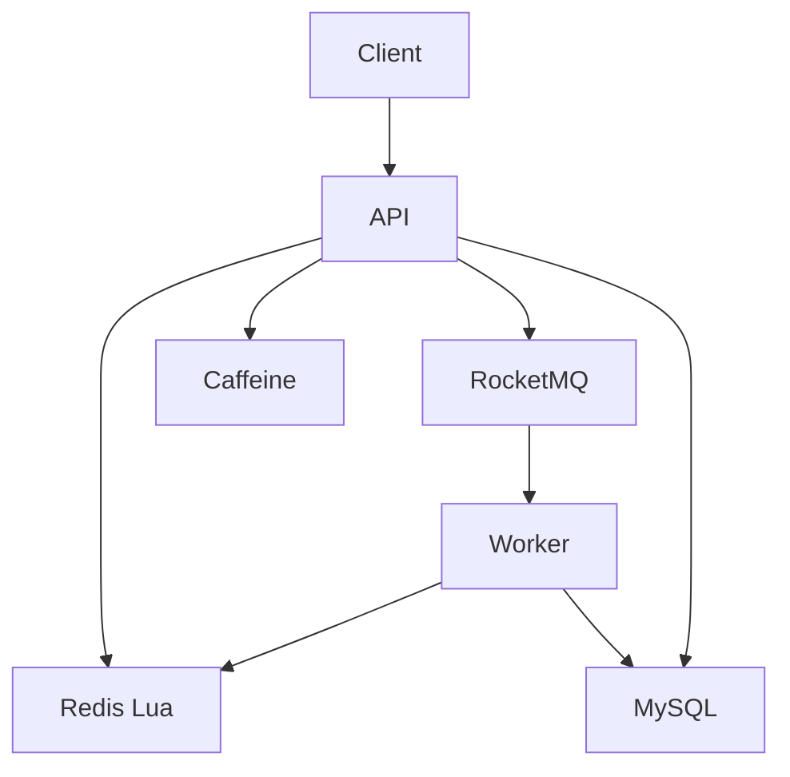
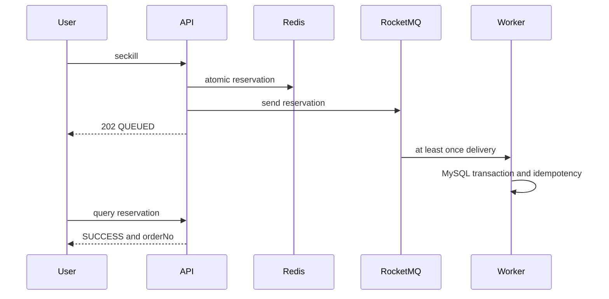
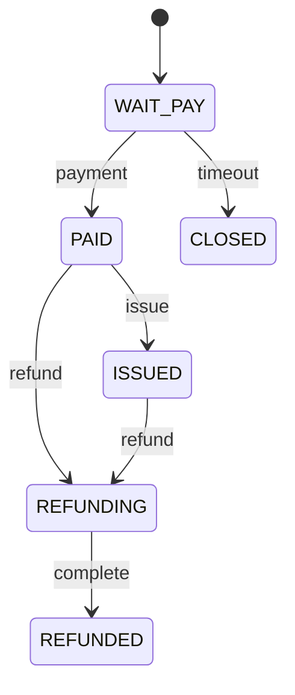

# FlashFlow

[](https://github.com/Astrea-296111/FlashFlow/actions/workflows/ci.yml)

Java 高并发限量票务秒杀与交易履约系统。以可复现的测试和失败实验解释库存、幂等、消息可靠性与性能取舍，与 [RepoPilot](https://github.com/Astrea-296111/RepoPilot) 的 AI Agent/Benchmark 工程互补。

## 架构

模块化单体，同一代码库分 API、Worker 两种运行角色，按业务划分包。







## 正确性与设计

Redis Lua 校验库存、资格和预占；MySQL 条件更新与唯一约束兜底，不能只依赖缓存。消费者和补偿先锁 SKU 再锁 reservation，终态阻止迟到消息复活；支付与关单争用同一事务状态，库存释放通过 outbox 幂等推进。发送结果不确定时保留预占等待消费/补偿，避免立即回补超卖。活动元数据使用 Caffeine，库存不使用本地缓存。限流默认开启；对照容量实验显式关闭。未强行加入微服务、Redisson、Sentinel 或 XXL-JOB。

Java 21、Spring Boot 3.5.16、Spring Security JWT、MyBatis-Plus/SQL、Flyway、MySQL 8.4.9、Redis 7.4.2、RocketMQ 5.3.3、Caffeine、Actuator/Micrometer、Prometheus/Grafana、JUnit/Testcontainers、k6。版本为本次实测锁定值。

## 测试和真实结果

42 项测试通过（3 单元 + 39 集成）；真实 MQ 故障单独验证。三轮每种方案各 3,000 请求、100 单，无超卖、无重复；环境为同机原生进程、8 核 quota/8 GiB、40 VU。

|方案/轮次|入口 RPS|入口 P95 ms|入口 P99 ms|成功请求入口 P99 ms|完成 P95 ms|完成 P99 ms|订单|
|---|---:|---:|---:|---:|---:|---:|---:|
|baseline/1|404.33|244.27|660.52|987.63|895.76|1013.46|100|
|optimized/1|1270.93|63.45|342.28|998.26|3628.77|3677.29|100|
|optimized/2|966.58|140.34|205.77|239.99|3226.60|3256.96|100|
|baseline/2|627.46|130.06|206.19|266.08|236.78|290.84|100|
|baseline/3|841.33|98.71|176.88|191.70|207.57|215.85|100|
|optimized/3|3089.52|32.71|50.56|70.72|1456.67|1460.76|100|

入口吞吐含售罄拒绝，不能当作订单 TPS。异步方案完成延迟高于同步。全部原始数据与失败记录在 benchmark/results，详见 [完整压测报告](docs/06-benchmark-report.md)。真实 MQ 重复投递、停机恢复、延迟关单及 mock 发送失败见 [故障报告](docs/07-failure-experiments.md)。

## 快速开始

```bash
cp .env.example .env
docker compose up --build -d
curl --fail http://localhost:8080/actuator/health
```

Java 21 + Docker：`./mvnw -B spotless:check verify` 启动 Testcontainers 验证；重压测由 benchmark 工作流手动触发。当前环境无 Docker daemon，完整 Compose、镜像构建与远端 Actions 尚未实测；本次验收使用同版本原生中间件。

管理账号 admin，默认演示密码 local-admin-only；按 .env.example 修改配置。Swagger `http://localhost:8080/swagger-ui/index.html`；API 8080、Worker Actuator 8081。登录 POST /api/v1/auth/login 后使用 Bearer token。创建活动/票档并 warm，再 POST /api/v1/seckill/{skuId}，轮询 GET /api/v1/seckill/result/{reservationId}，最后用 orderNo 模拟支付。完整请求与权限见 [API 手册](docs/08-api-and-runbook.md)。

监控：`docker compose --profile monitoring up -d`；Grafana `http://localhost:3000`，Prometheus `http://localhost:9090`，配置在 deploy/。业务正确性不能仅通过 HTTP 状态判断，需检查库存守恒审计。

## 文档与学习

- [市场调研](docs/00-market-and-reference-research.md) / [开源研究](docs/01-open-source-study.md)
- [模型](docs/02-domain-and-schema.md) / [Redis](docs/03-redis-design.md) / [一致性](docs/04-consistency-model.md) / [SQL](docs/05-mysql-and-index.md)
- [监控](docs/09-observability.md) / [简历调研](docs/10-resume-research.md) / [简历条目](docs/11-resume-project.md)
- [代码面试题](docs/12-interview-guide.md) / [学习路线](docs/13-learning-roadmap.md) / [交付报告](BUILD_REPORT.md)

代码按 auth/event/inventory/seckill/order/payment/messaging/infrastructure 等 feature 分组；benchmark/ 保存 k6、Python 审计脚本和结果；deploy/ 保存 Broker/监控配置；docs/adr/ 保存取舍。

## Limitations 与 Roadmap

非生产 benchmark；无真实支付与真实出票供应商；单 Redis、单 Broker，无 Redis Cluster 验证，无分片、无多 API 实例实验。无持久高可用或百万用户结论。模拟支付使用数据库记录。Redis 丢失状态采取失败关闭，活跃 SKU 不允许盲目预热。库存回补依赖维护任务，长期故障需人工审计。市场样本日期与覆盖限制已明确记录。完整 Docker 启动和远端 CI 是尚待验证的交付项。

后续先验证 Compose/CI，再进行多 API 实例、真实 Broker 网络故障、Redis 重启、持续成功订单负载和热门 SKU 的持久化容量实验。不开启无证据的生产级承诺。

设计参考及依赖说明见 [THIRD_PARTY_NOTICES.md](THIRD_PARTY_NOTICES.md)。

## 本轮复验状态

2026-09-30：spotless 和 3 项单元测试通过。旧验收 42 项通过证据仍为 20260930T122848Z-tests-final。当前执行隔离环境无法连接此前启动的 localhost MySQL。尝试独立临时数据库时，MySQL 创建 UNIX socket 被运行限制拒绝。因此本轮完整 verify 未通过环境启动，不能声称已再次通过全部集成测试。

初始 Mockito 动态 self-attach 失败已通过 Maven 显式 test javaagent 配置修复；再次运行推进到数据库连接阶段。提供失败日志用于区分业务失败与环境阻断，不替代原始成功验收。

## GitHub 发布

公开仓库已发布。远端提交由 GitHub API 导入完整源码树；原始分阶段开发历史保存在 Release 附件 FlashFlow-history.bundle，使用 `git clone FlashFlow-history.bundle FlashFlow-history` 查看。CI 状态以顶部动态徽章为准。
