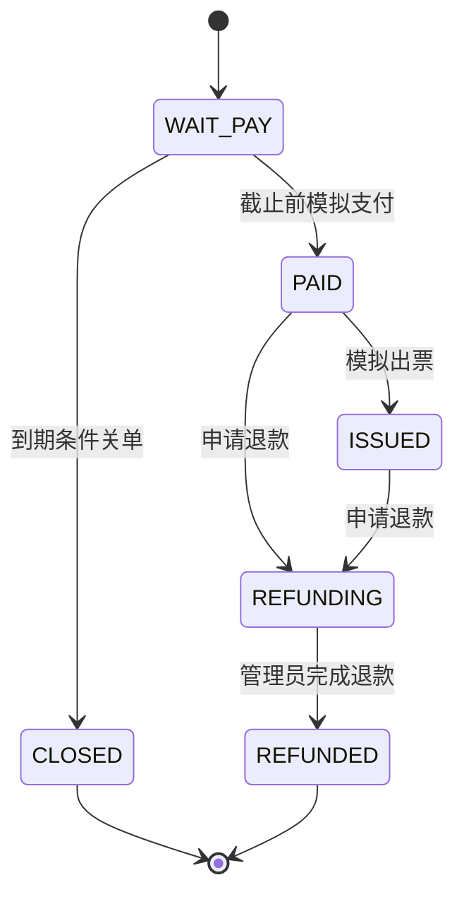

# 领域模型与数据库

FlashFlow 售卖活动的一种票档（SKU），一次资格对应一张票。价格只从数据库读取，HTTP 不接受用户提交的金额。支付、出票、退款是本地状态模拟，没有资金流、支付渠道回调或真实票券二维码。

| 表 | 职责 | 关键约束或索引 |
|---|---|---|
| app_user | BCrypt 凭据、USER/ADMIN 角色 | username UNIQUE |
| event | 活动与售卖窗口 | status,sale_start_at,id；结束必须晚于开始 |
| ticket_sku | 票档、持久化库存、BASELINE/ASYNC 模式 | event_id,id；库存 0..total_stock |
| seckill_reservation | 消息业务身份和持久化终态栅栏 | reservation_id PRIMARY；status,expire_at |
| orders | 订单金额、归属、支付截止与状态 | reservation_id UNIQUE；user_id,sku_id UNIQUE；status,expire_at,id |
| payment_record | 模拟支付的幂等凭证 | payment_key UNIQUE；order_no UNIQUE |
| message_outbox | 订单事务内写入超时通知意图 | business_key UNIQUE；status,id |
| stock_release_outbox | 关单事务内写入 Redis 回补意图 | reservation_id PRIMARY；status,created_at |
| message_quarantine | 无效消息隔离，不存完整原始正文 | SHA-256 PRIMARY |

完整可执行 DDL：[V1__domain.sql](../src/main/resources/db/migration/V1__domain.sql)。普通用户 CRUD 用 MyBatis-Plus；库存、状态迁移和 outbox 使用可审阅的参数化 JDBC SQL。没有另外创建 message_consume_log：reservation 行的业务身份、状态和唯一订单承担幂等栅栏，避免维护两份竞争的消费终态。

## 业务口径

每用户每 SKU 最多一张**持久化订单**，包括 CLOSED/REFUNDED。失败预占未创建订单时，回补后允许重试。关单后释放的票只能由尚未买过该 SKU 的其他用户购买；库存守恒中的“占用订单”排除 CLOSED/REFUNDED。因此审计不能简单拿所有历史订单数量与总库存比较。

SKU 初始 BASELINE。管理员只能在库存完整、没有订单且 Redis 没有该 SKU 残留状态时预热为 ASYNC。此后不能通过 baseline 接口购买，也不能在 Redis 丢失后直接重新预热。预热后活动售卖元数据冻结；已有成交后编辑也受 SALE_FROZEN 保护。后台冻结规则不代表实现了跨全部后台编辑与 baseline 的全局串行化，营业中的配置变更仍应停售后操作。

## 标识、时间与金额

reservation_id 是 `<skuId>-<UUID>`，能够从结果查询直接定位同槽 Redis 键；order_no 是另一枚 UUID。保留 MySQL 自增主键供索引和内部遍历，不将其用作支付幂等键。DB 字段为 TIMESTAMP(3)，JDBC 强制 UTC、应用 Clock 为 UTC；Python 实验连接也显式 SET time_zone='+00:00'。金额用 BigDecimal 和 DECIMAL(12,2)，没有 double 金额运算。

## 订单状态

`OrderStatus` 定义允许边；`OrderService` 的条件 UPDATE 是执行栅栏，不能只靠 Java enum 判断。支付和关单都锁同一订单，且分别检查 expire_at>now / expire_at<=now。获胜迁移和支付凭证/库存回补在同一 MySQL 事务提交。重复关单返回 false，不再次回补。重复退款完成返回状态冲突，不重复执行库存副作用。
