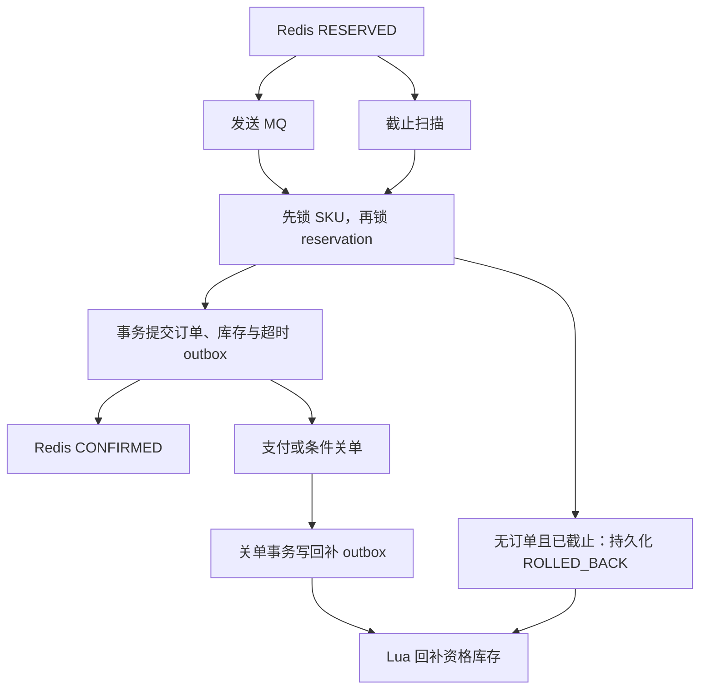

# 一致性模型与故障窗口

MySQL 订单与库存在一个本地事务内保持约束；Redis 资格库存与 MySQL 之间采用可重试的最终一致性。MQ 为至少一次处理语义。系统不提供跨 Redis/MQ/MySQL 的 exactly-once 事务。

## 为什么必须有持久化栅栏

“查不到订单→直接加回 Redis”会让迟到 consumer 在回补后创建订单。消费和补偿都通过同一 SKU 锁、reservation no-op UPSERT 和 FOR UPDATE 串行决定终态。补偿写入 ROLLED_BACK 后，迟到消息只能执行幂等回滚，不能创建订单。终态栅栏记录不自动删除；未来清理必须定义最大重放范围和业务 tombstone 保留策略。

初版重复 INSERT IGNORE→FOR UPDATE 出现共享锁升级死锁，已改为 no-op ON DUPLICATE KEY UPDATE。真实 MQ 压测还发现新预占的外键检查先获取 SKU S 锁，多消费者再升级为 X 锁；修复为先锁父 SKU，再插入 reservation。热 SKU 的数据库事务因此仍然串行，MQ 并没有消除最后一层库存写热点。

| 崩溃或故障窗口 | 可观察结果 | 处理方式 |
|---|---|---|
| Lua 成功，进程在 send 前退出 | Redis 预占，没有 DB 订单 | 截止索引扫描，DB 终态栅栏，再 Lua 回补 |
| send 超时，Broker 实际可能收到 | QUEUED/UNCERTAIN | 保留资格；consumer 与截止补偿争同一 DB 栅栏 |
| DB 提交前 consumer 失败 | 事务回滚，没有扣持久化库存 | MQ 重试；截止后按终态处理 |
| DB 已提交，Redis CONFIRM 前失败 | 已有订单，Redis 仍 RESERVED | 重复消费/截止扫描确认已有订单，不回补 |
| 重复消息或崩溃后重放 | reservation/用户 SKU 唯一约束命中 | 返回已有订单，不重复扣库存 |
| 关单 DB 已提交，Redis 回补前退出 | DB 已释放，Redis 暂少资格 | stock_release_outbox 反复执行幂等 CLOSE |
| 超时 outbox send 成功但 SENT 提交失败 | 可能再发超时消息 | 条件关单只成功一次 |
| Redis 数据完全丢失 | 活跃预占和发现索引丢失 | 停售；自动在线全量恢复未实现 |

Producer 只把 SEND_OK 当作已确认；任何其他结果仍保留预占。没有用 MQ 事务消息假装 Redis 前置操作和 MySQL 订单已经成为一个事务。

## 两种 outbox 的边界

message_outbox 与异步订单创建同事务，确保可持续重试发出超时通知。stock_release_outbox 与关单/退款回补同事务，确保 MySQL 的释放不会因为 Redis 一次异常永久丢失。Relay 批量使用 FOR UPDATE SKIP LOCKED；发送仍在短 DB 事务中，网络慢会占用连接和行锁，这是当前小规模实现的明确代价。

MQ 毒消息先落 SHA-256 隔离表再 ACK，持久化失败则重试。瞬时异常返回 RECONSUME_LATER，最大重消费 3 次后由 Broker 进入 DLQ；没有无人值守的 DLQ 重放系统，需要运维定位后使用隔离实验工具或官方 mqadmin 操作。

## 关单和模拟支付

支付、关单在同一订单行上互斥。支付条件是 WAIT_PAY 且未截止；关单条件是 WAIT_PAY 且已截止。只有成功关单事务才释放 DB 库存并写回补 outbox。异步使用经典 RocketMQ 固定延迟等级并向上取整；数据库 2s 扫描兜底。默认付款 TTL 600s 适配固定 10 分钟等级。baseline 不发超时 MQ，关单由相同 DB 扫描处理。

库存审计：`available_stock + COUNT(status NOT IN ('CLOSED','REFUNDED')) = total_stock`。异步全部预占完成/回补且 outbox 排空后，Redis stock 应与 MySQL available_stock 相等；处理中可以不同，不在每个瞬间承诺相等。
